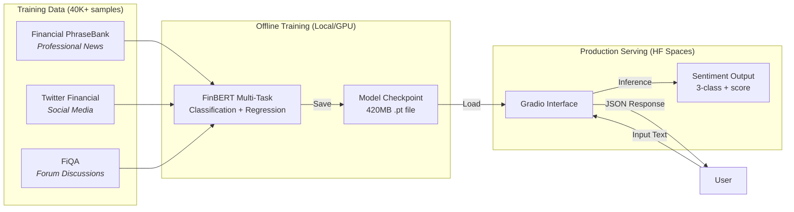

# Financial Sentiment LLM
[](https://huggingface.co/spaces/pmatorras/financial-sentiment-demo)


Fine-tuning FinBERT for financial sentiment analysis to integrate sentiment features into equity selection pipelines ([financial-ML](https://github.com/pmatorras/financial-ML)).


## Key Results (Phase 2)

*Optimisation Complete - Jan 22, 2026*


| Category | Model | Accuracy | Storage | Key Strengths |
| :-- | :-- | :-- | :-- | :-- |
| **Best Performance** | **FinBERT Multi-Task** | **85.4%** | ~420 MB | -  Best generalisation (+4.4%)<br>-  Necessary for forum discussions (FiQA) |
| **Best Efficiency** | **FinBERT LoRA (r16)** | 83.2% | **~5 MB** | -  **99% Storage Savings**<br>-  Matches performance on News/Twitter |

**🚀 [Try Live Demo](https://pablo.matorras.com/projects/finsentiment.html)** - Test the model on real financial text

**Next Steps:** Phase 3 - Deployment \& Integration into Financial-ML pipeline.

## Pipeline Architecture


**Design Decisions:**
- **Offline Training**: Computationally expensive fine-tuning runs locally on GPU (2 min/epoch), producing versioned model checkpoints
- **Lightweight Serving**: Hugging Face Spaces hosts the inference endpoint with automatic scaling and global CDN
- **Model Versioning**: Training outputs are saved as `.pt` files, enabling rollback and A/B testing
- **Live Demo**: Try the deployed model at [pablo.matorras.com/projects/finsentiment.html](https://pablo.matorras.com/projects/finsentiment.html)
## Model Architecture & Training

To handle the diverse nature of financial text, this project implements a **Multi-Task FinBERT** architecture. Unlike standard classifiers, this model shares a BERT backbone with two task-specific heads:

1. **Classification Head:** Predicts Negative/Neutral/Positive (for news/tweets).
2. **Regression Head:** Predicts continuous sentiment scores (for FiQA).

**Training data**

- [Financial PhraseBank](https://huggingface.co/datasets/takala/financial_phrasebank) (Professional news)
- [Twitter Financial News](https://huggingface.co/datasets/zeroshot/twitter-financial-news-sentiment) (Social media)
- [FiQA Sentiment](https://huggingface.co/datasets/TheFinAI/fiqa-sentiment-classification) (Forum discussions)

> ***Note**: Training uses 2:1 Twitter/PhraseBank ratio with decoupled sampling. See [EXPERIMENTS.md](EXPERIMENTS.md) for methodology.*

**Single vs Multi-task**

We compared our Multi-Task architecture against a standard Single-Task FinBERT baseline. The Multi-Task approach yielded a **+4.4%** increase in overall accuracy (85.4% vs 81.0%). The improvement was consistent across all data sources but was especially relevant in Twitter/Social Media, where accuracy increased by **+6.1%** (from 77.2% to 83.3%)

**Technical Strategy**
- **Multi-Task Loss:** We combine Cross-Entropy (for classes) and MSE (for scores) to handle diverse data formats simultaneously.
- **Robust Training:** Includes Early Stopping (patience=2) to prevent overfitting and fixed random seeds for Reproducibility.
- **Loss weighting:** Multi-task loss uses Cross-Entropy (classification) + weighted MSE (regression); defaults are rescaled to `1/10` for implementation convenience while preserving the original 1:10 ratio.

flowchart LR
    subgraph Training["Offline Training (Local/GPU)"]
        Raw[Financial PhraseBank] --> Train[FinBERT Fine-Tuning]
        Train -->|Export| Model[Model Artifact .bin]
    end

    subgraph Serving["Model Serving (Hugging Face Spaces)"]
        Model -->|Load| App[FastAPI/Gradio App]
        App -->|Inference| Logic[Sentiment Logic]
    end

    subgraph Client["User Interface"]
        Browser[Web Browser] -->|Input Text| App
        App -->|JSON/Prediction| Browser
    end

**Lightweight alternative (LoRA)**

We also tested **Low-Rank Adaptation (LoRA)** as a lightweight alternative to determine if we could maintain performance while drastically reducing model size.
- **Concept:** Freezes the 110M FinBERT parameters and injects small trainable rank decomposition matrices.
- **Result:** We achieved **83.2% accuracy** (vs 85.4% baseline) using only **5MB** of trainable weights.
- **Trade-off:**  LoRA matches the full model on standard news text but consistently underperforms on complex forum discussions (**FiQA**), both in the single and multi-task architectures, suggesting the full parameter space is needed for this specific domain.

## Validation Results
*Phase 2 (Jan 2026)*

We benchmarked multiple architectures on a fixed test set (N=1,896) to balance accuracy, efficiency, and robustness. 

| Model | Architecture | Overall Acc | F1-Score | PhraseBank | Twitter | FiQA | Storage |
| :-- | :-- | :-- | :-- | :-- | :-- | :-- | :-- |
| **FinBERT (Full)** | **Multi-Task** | **85.4%** | **0.83** | 95.9% | **83.3%** | **81.5%** | ~420 MB | ->checked
| **FinBERT (LoRA)** | Multi-Task | 83.2% |0.80 | **97.1%** | 80.5% | 72.6% | **~5 MB** |
| FinBERT (Full) | Single-Task | 81.0% | 0.77 | 95.3% | 77.2% | 80.6% | ~420 MB | 
| FinBERT (LoRA) | Single-Task | 79.0% | 0.79 | 95.8% | 75.4% | 73.4% | ~5 MB |
| BERT-Base | Multi-Task | 83.0% | 0.81 | 92.7% | 81.9% | 75.0% | 110M | ~420 MB |
| DistilBERT | Multi-Task | 82.0% | 0.79 | 90.3% | 80.7% | 75.0% | ~260 MB |

**Key results**
- **Best Overall Performance:** FinBERT Multi-Task achieves 85.4% accuracy, outperforming generic BERT (+2.4%) and DistilBERT (+3.4%), especially on professional news text.
- **Production (Cloud):** Use **FinBERT (Full)** for maximum robustness.
- **Production (Edge/Lightweight):** Use **FinBERT (LoRA)**. While total inference parameters are similar, the **trainable/storage footprint is 99% smaller (5MB)**.


### Detailed Performance comparison
The Full Model maintains stronger precision across "Negative" and "Neutral" classes, while LoRA achieves near-parity on "Positive" sentiment detection (0.87 F1 vs 0.89). This performance gap reflects LoRA's constrained capacity on complex financial text.

| Class | **FinBERT**  |  | | **LoRA** | | |
|-------|-----------|--------|----|-----------|--------|----|
|       | Precision | Recall | F1 | Precision | Recall | F1 |
| Negative | 0.78 | 0.77 | 0.77 | 0.72 | 0.76 | 0.74 |
| Neutral | 0.87 | 0.78 | 0.82 | 0.81 | 0.78 | 0.79 |
| Positive | 0.87 | 0.91 | 0.89 | 0.86 | 0.87 | 0.87 |


## Project Structure
```bash
├── src/
│   └── finsentiment/
│       ├── cli/                  # CLI entrypoints
│       │   ├── train.py
│       │   ├── evaluate.py
│       │   └── parser.py
│       ├── datasets/             # Data loading + splitting + dataset class
│       │   ├── __init__.py
│       │   ├── load.py           # Download/load HF datasets → pandas
│       │   ├── preprocessing.py  # Split / balance / combine datasets
│       │   ├── registry.py       # List of datasets used with weights
│       │   ├── sentiment.py      # Dataset wrapper (task_type-aware)
│       │   └── clean_data.py     # Optional cleaning utilities (default OFF)
│       ├── modeling/             # Model definition(s)
│       │   ├── __init__.py
│       │   ├── bert.py           # FinancialSentimentModel (cls + reg heads)
│       │   └── bert.py           # LoRAFinancialSentimentModel (cls + reg heads)
│       ├── training/             # Training loop(s)
│       │   ├── __init__.py
│       │   └── trainer.py
│       ├── evaluation/           # Metrics
│       │   ├── __init__.py
│       │   └── metrics.py
│       ├── config.py             # Global configuration
│       ├── main.py               # Application entry point
│       └── __main__.py           # python -m finsentiment
├── data/
│ └── raw/ # Auto-downloaded datasets
├── scripts/       # Stand alone scripts to run
├── models/        # Saved checkpoints
├── logs/          # Evaluation results  
├── app.py         # HuggingFace Space demo app
├── Dockerfile     # Demo containerisation
├── .gitignore     # Git ignore rules
├── EXPERIMENTS.md # Description of each experiment made
├── PROJECT.md     # Detailed roadmap & progress
└── README.md      # This file
```

## Installation

### Install PyTorch

Choose based on your hardware:

**GPU (NVIDIA CUDA):**
```bash
# GPU version
pip install torch --index-url https://download.pytorch.org/whl/cu121

# CPU version  
pip install torch --index-url https://download.pytorch.org/whl/cpu

```
### Install Project

```bash
# Clone and setup
git clone https://github.com/pmatorras/financial-sentiment-llm.git
cd financial-sentiment-llm
python -m venv .venv
source .venv/bin/activate # Windows: .venv\Scripts\activate
pip install -e . 
pip install -e ".[dev]" #with dev dependencies
```

### Verify Setup
```bash
python -c "import torch; print('CUDA available:', torch.cuda.is_available())"
```

## Usage

### Training
```bash
# Train with FinBERT (default, recommended)
python -m finsentiment train

# Train with LoRA (Efficient - 5MB checkpoint)
python -m finsentiment train --model finbert-lora-tuned

# Experiment with other models
python -m finsentiment train --model-name bert        # Generic BERT
python -m finsentiment train --model-name distilbert  # Lightweight variant

# All models support multi-task architecture (default) or single-task
python -m finsentiment train --model-type single
```
### Run the Demo locally
```bash
# Install demo dependencies
pip install -e ".[demo]"
mv models/finbert_multi_task_model.pt models/multi_task_model_phase2.pt #Or any other chosen model
# Launch the web interface
python app.py
# Opens at http://0.0.0.0:7860
```
> The local demo runs the same interface as the [**live HuggingFace Space**](https://huggingface.co/spaces/pmatorras/financial-sentiment-demo)

**Training Time:**
- **GPU (RTX 4050):** ~2 minutes per epoch
- **CPU (Intel Core Ultra 7):** ~20 minutes per epoch
> *Note: DistilBERT showed unexpectedly slower training in this configuration, likely due to dataloader bottleneck.*
### Evaluation
```bash
#Evaluate trained model on test set
python -m finsentiment evaluate # Defaults to Multi-Task architecture. Use --model-type multi for baseline.
```


## Resources

- [PROJECT.md](PROJECT.md) - Detailed roadmap and progress tracking
- [FinBERT Paper](https://arxiv.org/abs/1908.10063) - Financial domain BERT
- [HuggingFace PEFT docs](https://huggingface.co/docs/peft) - For upcoming LoRA implementation

---

**Note**: This is a learning project to develop production-grade LLM and NLP skills. Documentation and results are continuously updated as experimentation progresses.
